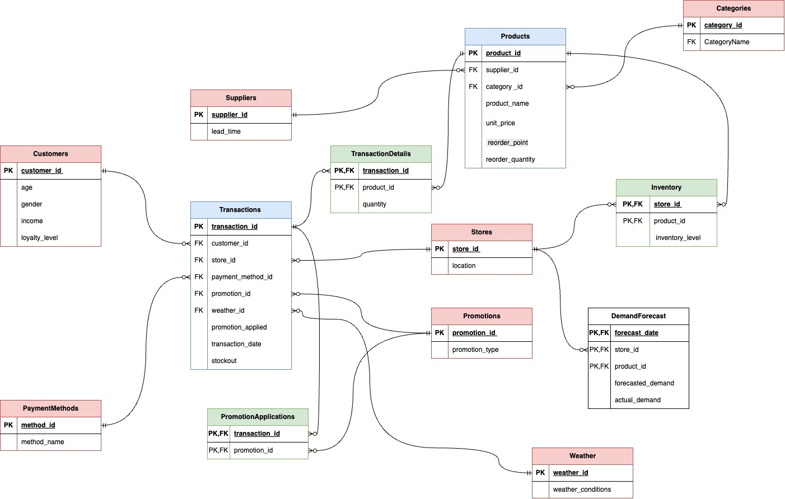
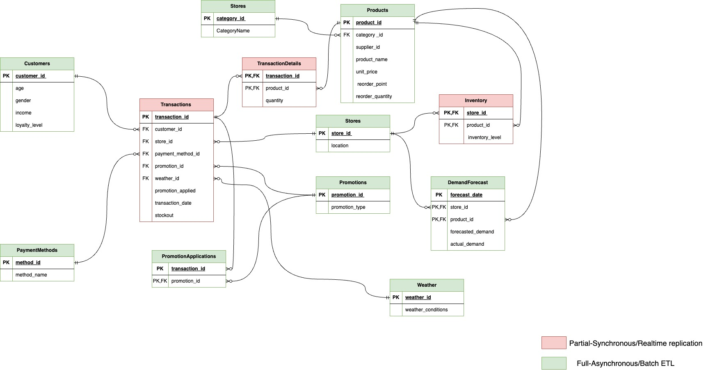

# Secure and Scalable Multi-Tenant Database Architecture for SaaS Using Row-Level Security (RLS) in PostgreSQL

---

# 📖 Introduction

This project builds a **secure, scalable, multi-tenant retail database** system for a SaaS application. It uses:
- **PostgreSQL** for OLTP transactions
- **Row-Level Security (RLS)** for strict tenant data isolation
- **Kafka + Debezium** for **real-time CDC replication** from PostgreSQL to MongoDB
- **MongoDB** for analytics and fraud detection

Dataset: Cleaned Walmart retail data.

---

# 🖼️ ERD and Architecture Diagrams

### 1. Database Design Overview


> This ERD shows the normalized relational schema where Customers, Products, Promotions, and Weather are linked to Transactions.

### 2. Final ERD after Normalization



> This final ERD includes additional normalization such as Categories and Suppliers to improve modularity and support tenant separation.

### 3. Replication Strategy Diagram



> Red tables are real-time replicated using Kafka+Debezium, Green tables are batch ETL loaded to MongoDB.

---

# 🗄️ PostgreSQL Schema (Full)

```sql
-- Creating all tables needed for the system.
-- This ensures full normalization and relationship integrity across Customers, Stores, Products, Transactions, Promotions, Inventory, and Forecasts.
```

---

# 📦 Python ETL for PostgreSQL

```python
# We load Walmart retail dataset using pandas.
# Then we prepare and insert into each table of the normalized PostgreSQL database.
# This is our initial data load into OLTP system.
```

---

# 🔄 Trigger and Procedure Code

```sql
-- We create a sequence for auto-incrementing transaction IDs.
-- We define a Trigger Function that automatically updates Inventory levels when TransactionDetails are inserted.
-- We also define a Stored Procedure for safer and batch-inserted Transaction + TransactionDetails insertions.
```

---

# 🛡️ Row-Level Security (RLS)

```sql
-- Enabling RLS on all critical tenant-related tables.
-- Creating different PostgreSQL roles for each store and an admin user.
-- Defining RLS policies so that each role can only access their own tenant-specific data.
```

---

# 🔗 Replication Setup SQL

```sql
-- Creating PUBLICATION named walmart_publication to expose all tables.
-- Testing by inserting transactions to validate replication setup.
-- Used later by Debezium Source Connector.
```

---

# 🐍 Batch ETL Python Script (PostgreSQL to MongoDB)

```python
# Reading all non-critical tables from PostgreSQL.
# Converting them into MongoDB-compatible documents.
# Backfilling them into MongoDB collections manually.
# Used for initial population of MongoDB (for dimension tables like customers, products).
```

---

# 🔌 Debezium PostgreSQL Source Connector

```json
-- Connector JSON configuration
-- It monitors PostgreSQL changes (CDC) on transactions, inventory, transactiondetails
-- Publishes them to Kafka topics.
```

---

# 🔌 MongoDB Sink Connector

```json
-- Connector JSON configuration
-- It reads CDC events from Kafka topics and writes them into MongoDB collections.
-- One sink connector handles multiple topics and maps them to different collections.
```

---

# 🔍 MongoDB Fraud Detection Aggregation Pipeline

```javascript
// MongoDB aggregation pipeline that compares the sold quantities vs inventory levels per day.
// If a product's sold quantity exceeds its recorded inventory, it flags it as potential fraud.
// Helps identify missing inventory or unrecorded sales.
```

---

# 📝 Conclusion

Through this project, we achieved:
- Fully normalized, scalable retail transaction OLTP database in PostgreSQL.
- Enforced strict data security and tenant isolation using RLS and RBAC.
- Built real-time replication pipelines using Kafka, Debezium, and MongoDB.
- Enabled fraud detection capabilities through real-time data aggregation in MongoDB.
- Delivered an architecture that is ready for production use in a Retail SaaS environment.

> 🎯 This project simulates a real-world scalable and secure SaaS system for retail businesses.

---

