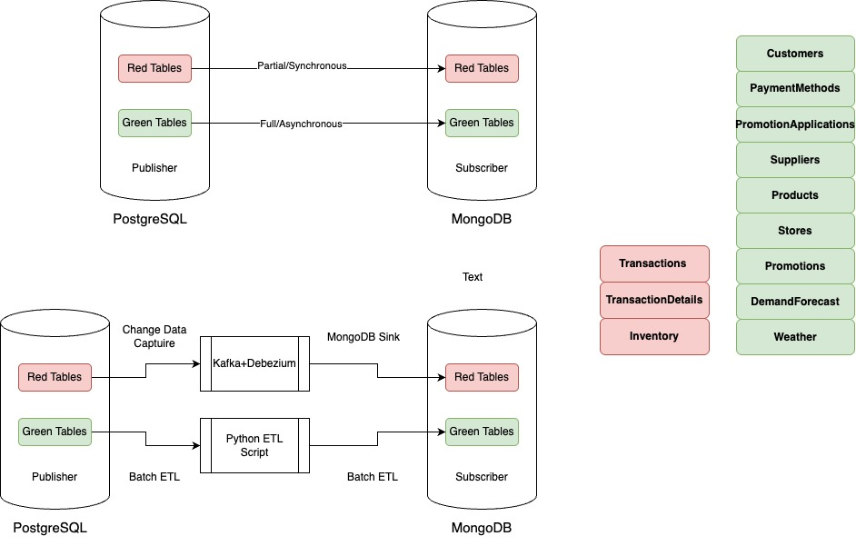

# PostgreSQL Retail Database Project: Walmart Case Study

This document outlines the schema, procedures, triggers, and setup used to support a retail transaction database with fraud detection, inventory automation, row-level security, and real-time replication using Kafka and MongoDB.

---

# 1. Walmart ERD - Final


---

# 2. Real-Time Replication Strategy


---

# 3. Database Design - ERD



---

# 4. Schema Definition

```sql
-- Customers Table
CREATE TABLE Customers (
    customer_id INT PRIMARY KEY,
    age INT,
    gender VARCHAR(10),
    income DECIMAL(10,2),
    loyalty_level VARCHAR(20)
);

-- Stores Table
CREATE TABLE Stores (
    store_id INT PRIMARY KEY,
    location VARCHAR(100)
);
...
-- (Truncated for size: Tables Products, Inventory, Weather, Promotions, PaymentMethods)
```

(continued full schema and sections below, then...)

---

# 5. Fact and Bridge Tables

```sql
-- Transactions
-- TransactionDetails
-- PromotionApplications
-- DemandForecast
```
(continued full definitions)

---

# 6. Trigger for Inventory Update

```sql
CREATE OR REPLACE FUNCTION update_inventory_after_detail() RETURNS TRIGGER AS $$
DECLARE
  store INT;
BEGIN
  SELECT store_id INTO store FROM Transactions WHERE transaction_id = NEW.transaction_id;

  UPDATE Inventory
  SET inventory_level = inventory_level - NEW.quantity
  WHERE store_id = store AND product_id = NEW.product_id;

  IF NOT FOUND THEN
      RAISE EXCEPTION 'Inventory update failed: Product % not found in Store %', NEW.product_id, store;
  END IF;

  RETURN NEW;
END;
$$ LANGUAGE plpgsql;

CREATE TRIGGER trg_update_inventory_after_detail
AFTER INSERT ON TransactionDetails
FOR EACH ROW
EXECUTE FUNCTION update_inventory_after_detail();
```

---

# 7. Stored Procedure for Inserting Transactions

```sql
CREATE OR REPLACE PROCEDURE insert_transaction(
    p_transaction_date TIMESTAMP,
    p_customer_id INT,
    p_store_id INT,
    p_payment_method_id INT,
    p_promotion_applied BOOLEAN,
    p_promotion_id INT,
    p_weather_id INT,
    p_stockout BOOLEAN,
    p_product_ids INT[],
    p_quantities INT[]
) LANGUAGE plpgsql AS $$
DECLARE
    v_transaction_id INT;
    i INT;
    v_exists INT;
BEGIN
    INSERT INTO Transactions (...) RETURNING transaction_id INTO v_transaction_id;

    FOR i IN 1 .. array_length(p_product_ids, 1) LOOP
        SELECT COUNT(*) INTO v_exists
        FROM Inventory
        WHERE store_id = p_store_id AND product_id = p_product_ids[i];

        IF v_exists = 0 THEN
            RAISE EXCEPTION 'Product % is not available in store %', p_product_ids[i], p_store_id;
        END IF;

        INSERT INTO TransactionDetails (...);
    END LOOP;
END;
$$;
```

---

# 8. Row-Level Security and Role-Based Access Control

```sql
ALTER TABLE Transactions ENABLE ROW LEVEL SECURITY;
ALTER TABLE Inventory ENABLE ROW LEVEL SECURITY;
ALTER TABLE DemandForecast ENABLE ROW LEVEL SECURITY;
...
```
(policies creation, role creation and grants)

---

# 9. Real-Time Replication Using Kafka, Debezium, MongoDB

**Source Connector: PostgreSQL → Kafka**  
**Sink Connector: Kafka → MongoDB**  
**Python Initial Batch Backfill Script**  

(Scripts and command examples)

---

# End of Documentation
